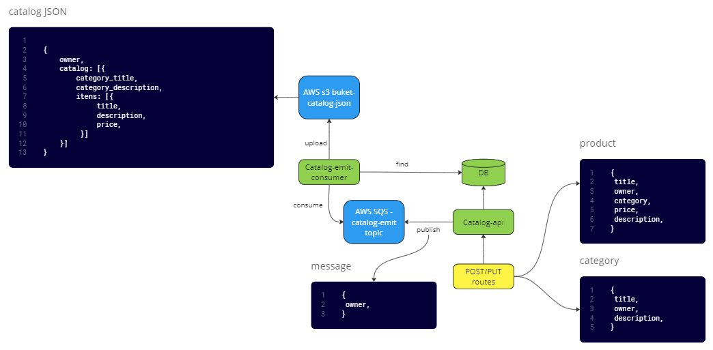

# "Anota ai" backend challenge

**Study Project**

- Reference: https://github.com/githubanotaai/new-test-backend-nodejs

**User Stories:**

- As a user, I want to register a product with its owner, so that I can access its data in the future (title, description, price, category, owner ID).
- As a user, I want to register a category with its owner, so that I can access its data in the future (title, description, owner ID).
- As a user, I want to associate a product with a category.
- As a user, I want to update the data of a product or category.
- As a user, I want to delete a product or category from my catalog.
- A product can only be associated with one category at a time.
- Assume that products and categories belong only to one owner.
- Keep in mind that this is an online product catalog, which means there will be multiple requests for editing items/categories per second, as well as accessing the catalog search endpoint.
- Consider the product catalog as a JSON compilation of all available categories and items owned by a user. This way, the catalog search endpoint does not need to fetch information from the database.
- Whenever there is a change in the product catalog, publish this change to the "catalog-emit" topic in the AWS SQS service.
- Implement a consumer that listens to catalog changes for a specific owner.
- When the consumer receives a message, search the database for that owner's catalog, generate the catalog JSON, and publish it to an AWS S3 service bucket.

**You need to develop this test using the following technologies:**

- MongoDB for the database.
- AWS SQS for the catalog change notifications.
- AWS S3 for storing the catalog JSON.
- Java for the backend.
- Spring as the web framework.

**Diagram representing the final structure of the project:**

**Instructions**

- Update the README file with instructions on how to run the application.
